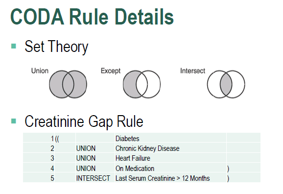

# CODA
CODA (Clinical Outcomes Decision Architecture) is a rules engine I designed for Kaiser Colorado's population health technology department. It uses SQL set operations to build member-selection rules, using member sub-set components. Developers have been using CODA since 2013 to calculate clinical care gaps, generate automatic orders, create member outreach (letter and IVR) cohorts, and more.

